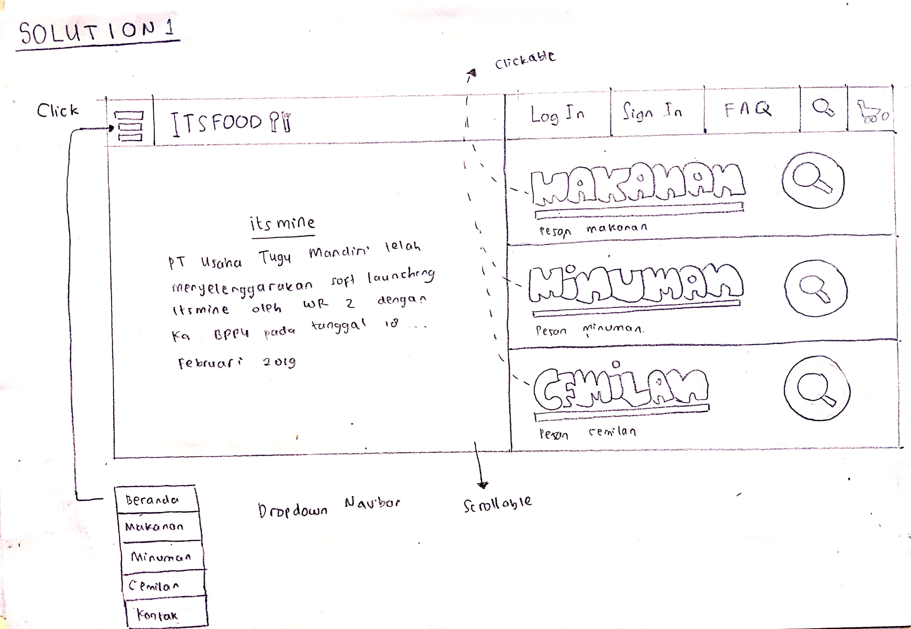
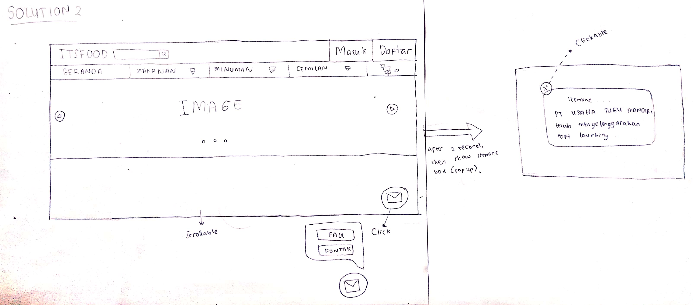
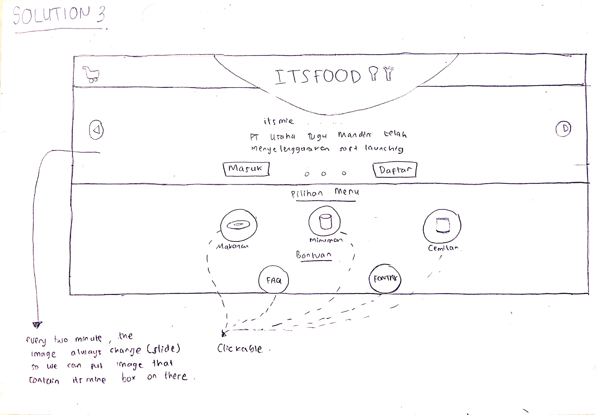

# Sketching and Prototyping

## Part A: Sketches

### 1. Scan/Photo of Sketches

<h4>Problem :</h4>

* There is no button and page for FAQ feature
* itsmine box hide troll button
* There are two button which has same function. It's 'Tentang Kami' and 'Kontak' button

<h4>Solution 1</h4>

<h4>Solution 2</h4>

<h4>Solution 3</h4>


### 2. Version Differences

<h4>Solution 1:</h4>

```
* Put troll function on top right corner and itsmine box on left.
* Put FAQ feature button on next Sign in.
* Merge between 'Tentang Kami' and 'Kontak' button into one button. Put on dropdown navbar.
```

<h4>Solution 2</h4>

```
* Make itsmine box is a pop up. When we close the pop up, it's doesnot appear again.
* Make a new button in lower right corner that contain 'FAQ' and 'Kontak' button.
* Put troll function on top right corne
```

<h4>Solution 3</h4>

```
* Put itsmine box in the center. 
  Every two minute, image always change(slide) so we can put that contain itsmine box on there.
* Put troll button in top left corner.
* Make a big button for FAQ and 'Kontak' in 'Bantuan' side
```

### 3. Selected Sketch
```
The writers choose solution one because in writes's opinion, 
- the design is more interesting. 
- it has complete feature 
- easy to use.
```

### 4. Design Rationale

```
In assignment-1 , we do interview with a user to test a website. 
User feel confused to do our instruction because of some design. 
From trancript interview, we make contextual inquiry 
that represent conclusion that what make the user feel confused.
From that contextual inquiry, we can revision that design website to make it better.
i do all do and don't in assignment one i make a prototype and freehand.
-DO
Make Forgot Password button.
Change ‘By clicking register, I agree to your terms’ button name into FAQ button name.
Make an alert if there is no result in search feature.
Change the position of the order form so there is not a lot of empty space.
-DON’T
Put troll feature behind the itsmine box
```

## Part B: Assumptions
### 1. Hardware
```
Screen size : 14 inch
Screen resolution : higher than 640 x 480 , ratio 4:3 with color
Computer minimum reqirement: 
	Processir:  Intel Core 2 Duo 2.0 GHz, AMD Athlon 64 X2 2.0 GHz or better,
	VGA : Intel HD Graphic, 
	RAM : 2 GB
Physical button : mouse and keyboard
```
### 2. Users

```
Every people in 6-60 ages can use this website. 
The user atleast have experience using a website in computer or gadget. 
The realible user have an experience to buy a product in online shopping
```

## Part C: Prototypes
<h3>Freehand Link</h3>
https://projects.invisionapp.com/freehand/document/11PgrQfYh
<h3>Prototype Link</h3>
https://invis.io/GER8AVK6T4V#/354599604_Main
<h3>High Prototype Link</h3>
https://invis.io/73RCMTN6VYS#/355981599_Home
